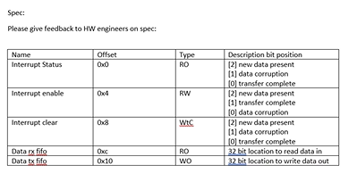
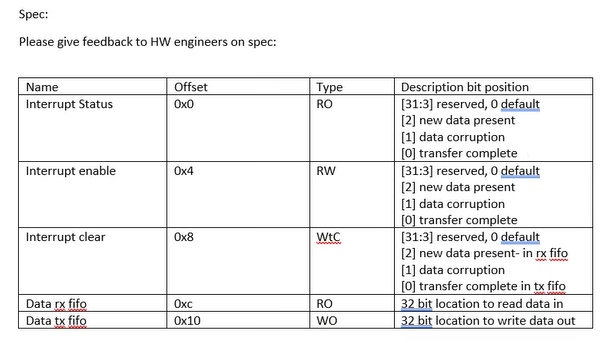

# Round 1

Interview with hiring manager Ava Shui.

```c
// hello!
// 0x100 = 5

int* ptr = 0x100;
ptr* = 5;

// 5 -> 2 (b101)
int count1s (int x) {
    int count = 0;
  while (x != 0) {
      count += (x & 0b1);
    x = (x>>1);
    }
  return count;
}

// Count stored at rega
// rega
// regb stores x

addi rega, zero, 0
// return count here if x == 0
while_label:
// temp is regc
andi regc, regb, 0x1
add rega, rega, regc
srri regb, regb, 0x1
bnq regb, reg0, while_label


BASE_ADDR=0xC500_0000
Reg0…
Reg1…
Reg2 Errors (RW1C)
    - [31:28] Rsvd (default 0)
    - [27] Correctable error detected
    - [26] Non-Fatal error detected
    - [25] Fatal error detected
    - [24] Unsupported request detected
    - [23:4] Rsvd (default 0)
    - [3] Slave completion overflow
    - [2] Unexpected completion
    - [1] Timeout detected
    - [0] Rsvd (default 0)

// Write a function in C, to check if any errors are logged in Reg2 and clear any that are (note: RW1C)

bool errors_detected() {
    int* reg2 = 0xC500_0000 + (2*4);
    bool errors_detected = false;
    int flag_bits = 0x0F0000E;
    int bad_error_flag_bits = 0x070000E;
    errors_detected = bad_error_flag_bits & *reg2; // detect errors
    reg2* = *reg2 & flag_bits;
    return errors_detected;
}
```

# Round 2

Skipped because round 1 went well.

# Round 3

Panel interview 4 rounds

Preparation:

1. General FPGA and Systems Design Questions
    - Describe the basic architecture of an FPGA.
    - What are the differences between FPGA and ASIC?
    - Explain the process of designing and implementing a digital circuit on an FPGA.
    - What are the key components of an FPGA, such as CLBs, LUTs, and DSP blocks?
    - How do you perform timing analysis on FPGA designs?
    - Describe the role of HDL (Hardware Description Language) in FPGA design.
    - What are the differences between VHDL and Verilog?
    - Can you explain the concept of pipelining in FPGA designs?
    - What is the importance of clock domain crossing in FPGA design, and how do you handle it?
    - Describe a situation where you had to optimize an FPGA design for speed or area.
2. Systems Programming Questions
    - How do you interface an FPGA with external memory?
    - Explain the process of writing and verifying FPGA firmware.
    - What are the common debugging techniques used in FPGA design?
    - How do you use simulation tools for FPGA design verification?
    - Describe the role of constraints files in FPGA design.
    - What methods do you use to ensure low power consumption in FPGA designs?
    - Explain the concept of partial reconfiguration in FPGAs.
    - How do you handle data integrity and error correction in FPGA systems?
    - What are the best practices for writing maintainable and reusable HDL code?
    - How do you integrate software and hardware in an FPGA-based system?
3. Architecture and Performance Questions
    - How do you design an efficient memory controller for an FPGA?
    - Explain the concept of hardware-software co-design and its importance in FPGA systems.
    - What is the role of an embedded processor in an FPGA system?
    - Describe how you would implement a high-speed data transfer interface (e.g., PCIe, Ethernet) on an FPGA.
    - How do you manage and optimize FPGA resources such as logic elements, memory blocks, and DSP slices?
    - What are some common performance bottlenecks in FPGA systems, and how do you address them?
    - Explain how you would implement a custom instruction set or accelerator in an FPGA.
    - How do you ensure scalability and modularity in FPGA designs?
    - Describe a complex FPGA project you have worked on and the challenges you faced.
    - What are the considerations for designing FPGAs for real-time applications?
4. Advanced Topics
    - Discuss the use of high-level synthesis (HLS) in FPGA design.
    - How do you approach designing FPGAs for machine learning or AI applications?
    - Explain the concept and applications of FPGA virtualization.
    - What are the latest advancements in FPGA technology that excite you?
    - How do you stay current with the latest tools and techniques in FPGA design?

Preparation:

1. General Systems & Programming:
    - Explain the difference between a process and a thread. How do these concepts relate to FPGA design?
    - Describe different methods of inter-process communication (IPC). Which methods might be relevant in an FPGA context, and why?
    - What are mutexes and semaphores? Provide an example of how they could be used in an FPGA-based system.
    - Explain the difference between synchronous and asynchronous communication. Discuss the trade-offs of each approach in FPGA design.
    - What are the different types of memory hierarchies? Discuss their relevance in the context of FPGAs and high-performance computing.
    - Describe different caching strategies (e.g., write-back, write-through). How might these strategies be implemented or utilized in an FPGA design?
    - What are some common software design patterns? Discuss how design patterns could be applied in the development of FPGA-based systems.
    - Explain the concept of real-time operating systems (RTOS). When might an RTOS be necessary in an FPGA system?
    - Explain the difference between hard real-time and soft real-time systems. Provide examples of each, potentially in the context of FPGAs.
    - Describe your experience with debugging and profiling systems. What tools and techniques have you used effectively?
2. FPGA-Specific Systems & Architecture:
    - Explain the difference between an FPGA and a CPU. When would you choose one over the other?
    - Describe the FPGA design flow, from specification to implementation.
    - What are the different types of logic elements in an FPGA? How are they used to implement complex designs?
    - Explain the concepts of clock domains and clock domain crossing. How do you address potential issues related to clock domain crossing in your designs?
    - What are the different methods for communicating data on and off an FPGA (e.g., PCIe, Ethernet, SPI)? Discuss the trade-offs of each approach.
    - Describe your experience with FPGA design tools (e.g., Vivado, Quartus). What are your preferred tools and why?
    - Explain the concept of timing closure in FPGA design. How do you ensure that your designs meet timing requirements?
    - What are some strategies for optimizing FPGA resource utilization?
    - Describe different techniques for implementing memory controllers on FPGAs.
    - How would you approach debugging a complex system that includes both software and FPGA components?
    - Describe your experience with high-level synthesis (HLS) for FPGA design. What are the advantages and disadvantages of using HLS?
    - What are some of the challenges in designing high-speed interfaces for FPGAs? How have you addressed these challenges in your previous work?
3. Behavioral Questions:
    - Describe a challenging FPGA design project you worked on and the key technical challenges you faced. How did you overcome them?
    - How do you stay up-to-date with the latest advancements in FPGA technology and systems programming?
    - Describe your preferred approach to collaborating with software engineers on a project involving both software and FPGA development.
    - How do you ensure the quality and reliability of your FPGA designs?

Nathan's prep Q's:
Systems:

1. Process vs thread:
    - What are the overhead implications.
    - What are the IPC implications.
    - Why would you choose thread vs process, process vs thread
2. Synchronization
     - What scenarios is a mutex required.
     - Mutex vs semaphore vs spinlock.
     - Deadlock, avoiding deadlock
3. Interrupt handlers
     - What are interrupt handlers used for. Alternatives?
     - Concerns around deadlock in interrupt handlers?
4. Memory leaks
     - What is a memory leak
     - Why do we need to free memory
     - Detecting memory leaks
     - Will an OS automatically free memory upon process termination
5. C Programming:
      - What does the static keyword do
      - What is the size of the following struct

    ```c
    struct foo {
        int bar;
        int zoo;
        char doo[5];
    };
    ```

      - What is the value of foo:

    ```c
        uint16_t *foo = 0x8;
        foo += 1;
    ```

Behavioural Questions:

1. Tell me about a time you had difficulty working with someone (can be a coworker, classmate, client).
    - What made this person difficult to work with for you? What steps did you take to resolve the problem?
    - Was the outcome? What could you have done differently? (Interpersonal effectiveness)
2. Tell me about a time when you were asked to do something you had never done before. How did you react? What did you learn?
3. What was the hardest technical challenge you've encountered? Why was it hard? What solutions did you consider?

Answers:

## FPGA Systems Design Engineering Interview Questions & Answers

**General Systems & Programming:**

1. **Process vs. Thread:** A process is an independent program with its own memory space. A thread is a lightweight execution unit within a process, sharing its memory space. In FPGAs, threads can represent concurrent hardware operations.
2. **IPC methods:** Shared memory, message passing, semaphores. In FPGAs, shared memory (BRAM, DDR) and custom communication protocols are common.
3. **Mutexes & Semaphores:** Synchronization tools. Mutex ensures only one thread accesses a resource at a time. Semaphores manage access for a limited number of threads. Useful for resource sharing in FPGA designs.
4. **Synchronous vs. Asynchronous Communication:** Synchronous requires both sender and receiver to be ready simultaneously (e.g., handshake). Asynchronous allows sending data without waiting (e.g., FIFO). Trade-off between speed and complexity.
5. **Memory Hierarchies:** Organized by speed and cost (registers, cache, RAM, disk). FPGAs utilize on-chip memory (BRAM) for speed and external memory (DDR) for capacity.
6. **Caching Strategies:** Write-back updates cache first, then main memory later. Write-through updates both simultaneously. FPGA designs rarely use traditional caching but benefit from similar strategies for data movement.
7. **Software Design Patterns:** Reusable solutions to common problems. In FPGAs, patterns like state machines and pipelines are frequently used for control and data flow.
8. **RTOS:** Real-time operating system ensures predictable timing for tasks. Necessary in FPGA systems with strict timing requirements, like control systems.
9. **Hard vs. Soft Real-Time:** Hard real-time requires guaranteed response times (e.g., aircraft control). Soft real-time allows occasional missed deadlines (e.g., video streaming). FPGA applications can be either depending on requirements.
10. **Debugging & Profiling:** Techniques include simulation, logic analyzers, and on-chip debugging tools. Understanding timing diagrams and resource utilization reports is crucial.

**FPGA-Specific Systems & Architecture:**

1. **FPGA vs. CPU:** FPGAs are configurable hardware offering parallelism and performance; CPUs are programmable and flexible. Choose FPGA for high-performance, dedicated tasks; CPU for general-purpose computing.
2. **FPGA Design Flow:**  Specification -> Design Entry (HDL) -> Simulation -> Synthesis -> Place & Route -> Timing Analysis -> Bitstream Generation -> Programming.
3. **FPGA Logic Elements:** Basic building blocks consisting of LUTs (Look-Up Tables), flip-flops, and multiplexers. Configured to implement logic functions, state machines, and more.
4. **Clock Domains & Crossing:** Separate clock signals within a design. Crossing requires synchronization techniques (e.g., FIFOs, dual-clock FIFOs) to avoid metastability.
5. **FPGA Communication Methods:** PCIe for high-speed data transfer, Ethernet for networking, SPI for communication with peripherals. Choice depends on speed, distance, and application requirements.
6. **FPGA Design Tools:** Vivado, Quartus are popular. Proficiency in RTL simulation, synthesis, and debugging tools within these environments is essential.
7. **Timing Closure:** Meeting timing constraints of the design to ensure proper operation at the desired clock frequency. Achieved by optimizing logic, placement, and routing.
8. **Optimizing Resource Utilization:** Techniques include logic optimization, resource sharing, efficient data structures, and pipelining to reduce logic elements and memory usage.
9. **Memory Controllers on FPGAs:** Implemented using state machines and dedicated logic to manage data transfer between FPGA and external memory (DDR).
10. **Debugging Software/FPGA Systems:** Requires understanding interactions between both domains. Techniques include JTAG debugging, logic analyzers, and co-simulation.
11. **High-Level Synthesis (HLS):** Allows design description in higher-level languages (C/C++). Advantages: faster design time, easier verification. Disadvantages: less control over hardware implementation.
12. **High-Speed Interface Challenges:** Signal integrity, timing closure, EMI/EMC compliance. Requires careful PCB design, signal conditioning, and adherence to interface specifications.

**Behavioral Questions:**

1. **Challenging FPGA Project:**  Describe the project, challenges (e.g., timing closure, resource constraints), your solution, and what you learned.
2. **Staying Up-to-date:** Attending conferences, reading technical papers, following industry blogs, participating in online forums.
3. **Collaborating with Software Engineers:** Clear communication, well-defined interfaces, joint testing, understanding of each other's constraints and workflows.
4. **Ensuring Design Quality:** Rigorous testing (simulation, hardware-in-the-loop), code reviews, following design best practices, using static analysis tools.

## Panel 1 - Manigopal Vepati

```c
Allocate 10 integers using dynamic memory allocation and free them.

int*array = malloc(sizeof(int)*10);
free(array);

Swap two variable without using temp variable.
int a = 30;
int b = 40;

a = a+b; // 70
b = b-a; // -30
a = a +b; // 40
b = -b; // 30

a, b = (b, a)

Scenario: Explain the below code and possible output?
LDR - load // loading from memory
STR - Store // placing into memory

Core A:
 STR R0, [Addr1] // Setting addr1 to val of r0
 LDR R1, [Addr2] // taking from addr2 and loading into r1

Core B:
 STR R2, [Addr2]
  LDR R3, [Addr1]

Write a program to check status register for DMA DONE - for example bit 16 is DMA DONE in a register.

```

```python
spin_lock = True
while spin_lock:
  dma_done: i32 = 0x12312312
  done_mask: i32 = 0x1 << 16

  is_done: bool = done_mask & dma_done

  if is_done:
    # The dma is done
    break
    spin_lock = False
  else:
    # dma is not done


Fibonacci series:

1,1,2,3,5
0,1,2,3,4
def fib(a: int) -> int:
 if a <= 1:
   return 1
  else:
   return fib(a-1) + fib(a-2)
```

## Panel 2 - Catherine Warren

Digital design section:

What are the steps involved in going from HDL to FPGA?

What are the metrics you can use to make sure you are synthesizing correctly?

- When synthesized what can cause the number of LUTs or synthesized constructs to be far lower or higher than expected?

Describe is one-hot encoding?

What is your familiarity with synthesis tools?

How you would create a Content Addressable Memory, how that relates in software.

For a 128 address memory with 32 bit words. Design the logic for getting the address of a unique word.

- Logic for comparison
  - What gates to use
  - XNOR gate comparison
  - AND gate tree
- Logic for getting address

## Panel 3 - Jue Arver

Went well.





```c
int interrupt_handler(int base_addr) {

  int status;

  status = *base_addr;


  if (status & 0b001){ // 0x1
    printf(“transfer complete\n”);
    write_data(); // writes to tx fifo
  }
  if (status & 0b010){ // 0x2
    printf(“data corruption\n”);
    Fatal_error();
  }
  if (status & 0b100){
    Printf(“data present in RX fifo is %08x\n”, *(base_addr + 0xc));
  }

  //
  *(base_addr + 0x8) = 0b111;
  // Interrupt clear write 1 to clear

  Return 1;
}


int interrupt_handler(int base_addr) {

int status;

status = *base_addr;

if (status && 0x1){
 printf(“data complete\n”);
 write_data();
} else if (status && (1<<1)){
 printf(“data corruption\n”);
 Fatal_error();
} else if (status && 0x3){
 Printf(“data present in RX fifo is %08x\n”, &(base_address + 0xc));
}

*(base_address + 0x8) = 0x7;

Return 1;
}

```

## Panel 4 - Venkatesh

1) Write a logic to multiply a given even number with 3.5 using just Shift operations?

```c

int x = 12341;
1 + 2 + 0.5

int result = (x) + (x << 1) + (x >> 1);

```

2) I have a ReadWrite 32-bit register, can you pls set bit[14:11] = 3
lets say Register current value is 0xdeadbeef

```c

int reg = 0xdeadbeef;
int mask = !(0xF << 11);
reg = mask & reg; // turn off bits 14:11
reg = (3 << 11) | reg;

```

3) Write a function called as dump() which takes a base address and number of registers as arguments and prints out the register current values, 4 register values per print. let's say 100 registers,
each line prints max 4 register values but only if at least one of them is non-zero.

```c

1 2 3 4
0 0 0 0
0 1 2 0


1 2 3 4
0 1 2 0

// THis does not work in a concurrent environment
void dump(int* base_addr, int num_registers) {
 for (int group = 0; group < num_registers; group += 4 ) {
   bool all_zero = true;

   for(int idx = group; idx < num_registers && idx < group + 4; idx ++) {
     if (base_addr[group+idx] != 0) {
       all_zero = false;
   }
    }

    if (!all_zero) {
     // print registers
      for(int idx = 0; idx < num_registers && idx < group + 4; idx ++) {
        printf("%x ", base_addr[group + idx]);
      }
    }
  }
}
```

# Offer

openings for 2 positions

Start date June 24th.

Level 202

- Compensation - rigid compensation
- base of 130k RSU at 43k
- Sign on 15k
- Relocation 10k
- Email will come in today or Monday 48hrs business days
